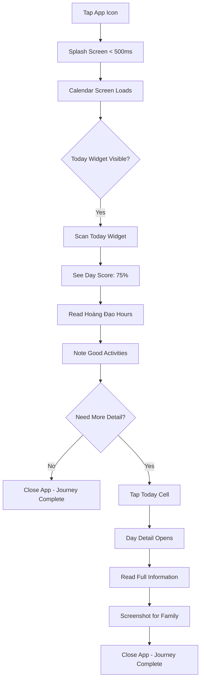
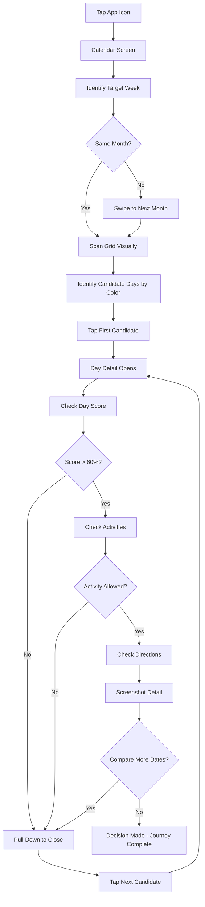
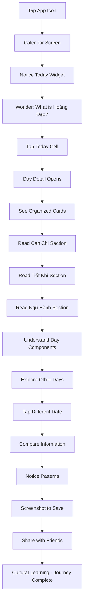

# UX Design Specification - Lịch Việt Vạn Sự An Lành

**Author:** Bằng Ca
**Date:** 2024-12-16

---

## Executive Summary

### Project Vision

Transform **Lịch Việt Vạn Sự An Lành** from a functional Vietnamese lunar calendar tool into a delightful daily companion. The redesign creates a unique blend of traditional Vietnamese culture with modern mobile UX patterns, prioritizing glanceability, natural navigation, and visual clarity.

**Core UX Pillars:**
1. **Instant Value** - Today's feng shui info visible without any taps
2. **Natural Flow** - Swipe and tap navigation that feels intuitive
3. **Visual Clarity** - Dual calendar (solar + lunar) readable at a glance
4. **Daily Habit** - Design encourages daily check-ins

### Target Users

**Primary Personas:**

| Persona | Age | Need | Key Behavior |
|---------|-----|------|--------------|
| Chị Lan - Daily Planner | 45 | Quick daily feng shui reference | Morning check, shares with family |
| Anh Minh - Event Planner | 32 | Find auspicious dates for business | Compares multiple dates, needs directions |
| Em Hương - Explorer | 20 | Learn traditional culture | Curious, explores terminology, screenshots to share |

**User Characteristics:**
- Vietnamese-speaking users familiar with lunar calendar concepts
- Range from feng shui experts to cultural beginners
- Use both iOS and Android devices
- Often share screenshots with family/friends
- Prefer visual information over text-heavy explanations

### Key Design Challenges

1. **Information Architecture**
   - Balance comprehensive feng shui data with clean visual hierarchy
   - 12+ data points per day (lunar date, Can Chi, Tiết Khí, Ngũ Hành, activities, hours, directions, score)
   - Must be scannable in < 3 seconds

2. **Dual Calendar Display**
   - Show solar (large) + lunar (small) dates in each 42x42pt cell
   - Maintain readability on 4.7" screens
   - Color-code weekends without creating visual noise

3. **Navigation Patterns**
   - Swipe left/right for month navigation
   - Tap for day selection
   - Both gestures on same surface without conflicts
   - Arrow buttons as alternative navigation method

4. **Performance Constraints**
   - 60+ day cells must render in < 100ms
   - Month transitions at 60 FPS
   - No jank during continuous navigation

5. **Persistent Context**
   - Today preview widget always visible
   - User can browse future months while seeing today's info
   - No loss of context during exploration

### Design Opportunities

1. **Competitive Differentiation**
   - First Vietnamese calendar app with always-visible feng shui preview
   - Eliminate the "3-4 taps to see today's hours" friction

2. **Color as Communication**
   - Green = positive/auspicious (Saturday, today, good activities, good hours)
   - Red = caution (Sunday, activities to avoid)
   - Instant emotional response before reading text

3. **Progressive Disclosure**
   - Calendar screen: Essential info only (dates, weekends, today preview)
   - Day detail: Complete feng shui information
   - Users choose their depth of engagement

4. **Cultural Bridge**
   - Make traditional concepts approachable for younger users
   - Icon system for terminology (sun for Hoàng Đạo, star for Tiết Khí, drop for Ngũ Hành)
   - Modern card-based UI for traditional content

## Core User Experience

### Defining Experience

**The ONE thing users will do most frequently:**
Open the app to check today's feng shui guidance - specifically the auspicious hours (Giờ Hoàng Đạo).

**Core User Actions (in frequency order):**
1. **Glance at today's info** - See Hoàng Đạo hours, Tiết Khí, Ngũ Hành without tapping
2. **Browse months** - Swipe to find dates for future events
3. **View day details** - Tap a date to see full feng shui information
4. **Compare dates** - Check multiple days to find the best one

**The Defining Interaction:**
The moment user opens the app and IMMEDIATELY sees today's feng shui summary in the persistent bottom widget - no taps required. This is the "zero-friction value delivery" that differentiates us.

### Platform Strategy

**Platform:** Cross-platform mobile app (iOS & Android via React Native)

**Primary Interaction Mode:** Touch-based with gesture support
- Swipe gestures for month navigation
- Tap for day selection
- Scroll for detailed content

**Platform Requirements:**
- **Offline-first**: 100% functionality without internet
- **Performance**: 60 FPS animations, < 100ms render time
- **Screen sizes**: 4.7" (iPhone SE) to 12.9" (iPad Pro)
- **Device capability leverage**: Haptic feedback on iOS for today indicator

**Platform Constraints:**
- Must work identically on iOS and Android
- No native platform-specific UI (unified design system)
- Vietnamese diacritics must render correctly everywhere

### Effortless Interactions

**Zero-Thought Actions (Must Feel Automatic):**

| Action | Current Friction | Our Solution |
|--------|------------------|--------------|
| See today's auspicious hours | 3-4 taps in competitor apps | Always visible in bottom widget |
| Navigate months | Arrow buttons only | Swipe + arrows (user choice) |
| Understand solar/lunar | Toggle between views | Both displayed simultaneously |
| Find weekends | Scan for patterns | Color-coded (green/red text) |
| Know if today is auspicious | Read text analysis | Visual Day Score (75% + progress bar) |

**Automatic Behaviors:**
- Today preview widget updates at midnight
- Current auspicious hour highlighted in detail view
- Upcoming holidays calculated and displayed with countdown
- Return to today when navigating far and coming back

**Eliminating Steps vs Competitors:**
1. **Competitor**: Open app → Tap today → Scroll → Find hours → **4 steps**
2. **Our design**: Open app → See hours → **1 step**

### Critical Success Moments

**The "This is Better" Moment:**
User opens app and realizes they can see BOTH the calendar AND today's feng shui info at the same time. No mode switching.

**User Success Moments:**

| Moment | What Happens | Success Signal |
|--------|--------------|----------------|
| First Launch | See today's info immediately | User doesn't need to tap anything to get value |
| Month Navigation | Swipe through months fluidly | Animation is smooth, today widget persists |
| Day Selection | Tap date, see full details | < 150ms load, comprehensive info |
| Decision Made | Find auspicious date for event | User screenshots and shares with family |
| Daily Return | Check today's guidance | Becomes morning habit |

**Make-or-Break Flows:**
1. **First 3 seconds**: If today's info isn't immediately visible, user assumes app is like competitors
2. **Month swipe**: If laggy or janky, perceived as low-quality app
3. **Day detail load**: If slow, user won't compare multiple dates
4. **Dual date reading**: If confusing, user abandons for simpler app

**First-Time User Success:**
User understands how to read the calendar (dual dates, color coding) and finds today's auspicious hours within 10 seconds - without any onboarding.

### Experience Principles

**Guiding Principles for All UX Decisions:**

1. **Instant Gratification**
   - Value delivered before any tap
   - No loading states for core functionality
   - Today's info visible from moment app opens

2. **Familiar Yet Better**
   - Standard calendar grid layout
   - Gestures that match iOS/Android conventions
   - Improved with feng shui layer, not replaced

3. **Progressive Complexity**
   - Level 1: See today's essentials (no tap)
   - Level 2: Browse month grid (swipe/arrows)
   - Level 3: Full day details (tap)
   - User controls depth of engagement

4. **Visual Language Over Text**
   - Colors communicate meaning (green = good, red = caution)
   - Icons for terminology (sun, star, drop)
   - Progress bars for scores
   - Reduce cognitive load

5. **Context Persistence**
   - Today widget always visible during navigation
   - Don't lose user's place
   - Easy return to today (visual anchor)

6. **Screenshot-Ready Design**
   - Information density optimized for sharing
   - Complete context in single screen
   - Readable when shared via messaging apps

## Desired Emotional Response

### Primary Emotional Goals

**Core Emotion: Confident Reassurance**
Users should feel confidently guided in their daily decisions, trusting that the app provides accurate and culturally authentic feng shui information.

| Emotion | Description | When It Should Occur |
|---------|-------------|---------------------|
| **Confident** | "I trust this information" | When viewing day scores, activities, and auspicious hours |
| **Calm** | "Everything I need is right here" | When opening app and seeing today's preview instantly |
| **Empowered** | "I can make informed decisions" | When comparing dates or planning events |
| **Delighted** | "This is beautifully designed" | When navigating smoothly through months and screens |

### Emotional Journey Mapping

| Stage | Desired Emotion | Design Implication |
|-------|-----------------|-------------------|
| **First Discovery** | Intrigued + Impressed | Clean visual hierarchy, immediate value display, cultural authenticity |
| **Core Experience** | Focused + Confident | Scannable information, clear color coding, no cognitive overload |
| **After Task Completion** | Satisfied + Reassured | Clear confirmation of good/bad days, shareable summaries |
| **When Something Goes Wrong** | Supported + Guided | Graceful error states, helpful suggestions, never blame user |
| **Returning User** | Welcome + Habitual | Familiar patterns, updated daily content, quick access |

### Micro-Emotions

**Positive Micro-Emotions to Cultivate:**

| Micro-Emotion | Trigger | Design Response |
|---------------|---------|-----------------|
| **Trust** | Accurate lunar calculations | Cross-validated data, consistent results |
| **Accomplishment** | Found the perfect date | Visual celebration (green highlights, checkmarks) |
| **Belonging** | Cultural connection | Traditional Vietnamese terminology, authentic content |
| **Clarity** | Understanding complex info | Progressive disclosure, visual hierarchy |
| **Control** | Navigating easily | Responsive gestures, multiple navigation options |

**Negative Micro-Emotions to Avoid:**

| Emotion | Cause | Prevention Strategy |
|---------|-------|---------------------|
| **Confusion** | Too much information | Clean hierarchy, progressive disclosure |
| **Frustration** | Slow navigation | 60 FPS animations, instant feedback |
| **Anxiety** | Uncertain about auspiciousness | Clear scoring system, color coding |
| **Skepticism** | Questionable accuracy | Data validation, source transparency |
| **Isolation** | Can't share findings | Screenshot-ready design, share features |

### Design Implications

| Emotion | UX Design Approach |
|---------|-------------------|
| **Confident** → | Authoritative visual design with consistent data presentation, professional typography |
| **Calm** → | Soft green color palette for positive elements, generous whitespace, uncluttered layouts |
| **Empowered** → | Information architecture that supports comparison, clear day scores with visual progress bars |
| **Delighted** → | Smooth 60 FPS animations, haptic feedback on iOS, subtle micro-interactions |

### Emotional Design Principles

1. **Trust at First Glance**
   - Professional, clean aesthetic builds immediate credibility
   - Cultural authenticity in terminology and visual language
   - No ads or distracting elements that diminish trust

2. **Zero Anxiety Navigation**
   - User always knows where they are (today indicator, month/year header)
   - Multiple ways to navigate (swipe, arrows, tap) - user chooses comfort
   - Easy return to "today" from anywhere

3. **Gentle Authority**
   - Present feng shui guidance as helpful, not prescriptive
   - Color coding (green/red) provides guidance without alarm
   - Day scores are informative, not judgmental

4. **Shareworthy Pride**
   - Users feel proud to share screenshots with family
   - Information density optimized for messaging apps
   - Design reflects cultural pride in Vietnamese traditions

5. **Daily Ritual Reinforcement**
   - Opening the app should feel like a positive morning routine
   - Fresh content daily (today's hours, activities) creates anticipation
   - Quick interactions respect user's time

## UX Pattern Analysis & Inspiration

### Inspiring Products Analysis

**1. Apple Calendar (iOS)**

| Aspect | UX Excellence | Relevance to Our Product |
|--------|--------------|-------------------------|
| **Core Strength** | Month grid with swipe navigation | Direct application - our primary interaction model |
| **Visual Hierarchy** | Clean typography, subtle color coding | Supports our dual-date display challenge |
| **Navigation** | Fluid month transitions, today button | Same navigation paradigm we need |
| **Information Density** | Progressive disclosure (grid → day detail) | Matches our calendar → day detail flow |

**Key Patterns Extracted:**
- Month name + year in header (centered, prominent)
- Arrow buttons flanking month name for accessibility
- Today indicator as visual anchor (circle highlight)
- Smooth horizontal swipe for month transitions
- Single tap to drill into day details

**2. Weather Apps (Dark Sky, Apple Weather)**

| Aspect | UX Excellence | Relevance to Our Product |
|--------|--------------|-------------------------|
| **Core Strength** | Glanceable "now" information | Our today preview widget concept |
| **Visual Hierarchy** | Large primary metric, supporting details below | Day score + feng shui summary layout |
| **Time-Based Data** | Hourly breakdown with visual timeline | Giờ Hoàng Đạo (auspicious hours) display |
| **Color Communication** | Color gradients communicate conditions | Green/red for auspicious/caution activities |

**Key Patterns Extracted:**
- Primary information prominently displayed (temperature = day score)
- Secondary metrics in supporting grid (humidity, wind = Can Chi, Tiết Khí)
- Hourly timeline with visual indicators
- "Currently" section always visible

**3. Vietnamese Cultural Apps (Lịch Vạn Niên competitors)**

| Aspect | What Works | What to Improve |
|--------|-----------|-----------------|
| **Data Completeness** | Comprehensive feng shui information | Often overwhelming, needs hierarchy |
| **Cultural Authenticity** | Traditional terminology | Sometimes outdated visual design |
| **Functionality** | All features present | Navigation often clunky, not gesture-based |

**Competitive Gap Identified:**
- No competitor offers persistent "today preview" widget
- Most require 3-4 taps to see auspicious hours
- Dual calendar display often confusing

### Transferable UX Patterns

**Navigation Patterns:**

| Pattern | Source | Application in Our App |
|---------|--------|----------------------|
| **Horizontal Swipe + Arrows** | Apple Calendar | Month navigation with accessibility fallback |
| **Persistent Today Anchor** | All calendar apps | Bottom widget shows today regardless of browsed month |
| **Drill-Down Tap** | iOS standard | Tap date cell → full day detail screen |
| **Pull-to-Return** | Common iOS pattern | Pull down on day detail to dismiss |

**Information Architecture Patterns:**

| Pattern | Source | Application in Our App |
|---------|--------|----------------------|
| **Glanceable Widget** | Weather apps | Today preview with Hoàng Đạo hours, day score |
| **Progressive Disclosure** | Apple ecosystem | Grid (essential) → Detail (comprehensive) |
| **Color as Data** | Weather/Health apps | Green = positive, Red = caution |
| **Visual Progress Indicator** | Health/Fitness apps | Day score as progress bar (75% = 75% filled) |

**Visual Design Patterns:**

| Pattern | Source | Application in Our App |
|---------|--------|----------------------|
| **Card-Based Sections** | iOS system design | Feng shui data in distinct cards |
| **Icon + Label Pairs** | Settings, Compass | Sun icon for Hoàng Đạo, drop for Ngũ Hành |
| **Dual-Size Typography** | Calendar apps | Large solar date, small lunar date |
| **Accent Color Coding** | All modern apps | Weekend differentiation (Sat green, Sun red) |

### Anti-Patterns to Avoid

| Anti-Pattern | Why It Fails | Our Prevention |
|--------------|--------------|----------------|
| **Information Overload** | Vietnamese calendar apps show everything at once | Progressive disclosure - essential on grid, details on tap |
| **Tiny Touch Targets** | Cramped calendar cells cause tap errors | Minimum 42x42pt cells, clear tap feedback |
| **Mode Confusion** | Toggle between solar/lunar views loses users | Show both simultaneously, clearly differentiated |
| **Deep Navigation** | 3-4 taps to reach common information | Today widget eliminates navigation for daily use |
| **Cluttered Headers** | Multiple nav elements compete for attention | Single header with month/year + simple arrows |
| **Inconsistent Gestures** | Swipe conflicts with scroll | Clear swipe zones, no gesture conflicts |
| **Text-Heavy Explanations** | Users don't read long descriptions | Icons, colors, and visual hierarchy communicate meaning |
| **Outdated Visual Design** | Traditional doesn't mean old-fashioned | Modern card-based UI with cultural authenticity |

### Design Inspiration Strategy

**What to Adopt Directly:**

| Pattern | Rationale |
|---------|-----------|
| Apple Calendar month grid layout | Proven, familiar, supports dual-date display |
| Weather app "current conditions" widget | Perfect model for today preview |
| iOS card-based information sections | Modern, clean, supports progressive disclosure |
| Standard navigation gestures (swipe, tap) | Zero learning curve for users |

**What to Adapt:**

| Pattern | Adaptation Needed |
|---------|------------------|
| Weather hourly timeline | Adapt for 12 time periods (Giờ Hoàng Đạo) with Vietnamese labels |
| Health app progress rings | Simplify to progress bar for day score |
| Settings icon+label pairs | Create custom icons for feng shui concepts (Can Chi, Tiết Khí, Ngũ Hành) |
| Dark Sky color gradients | Use cultural green/red instead of temperature colors |

**What to Avoid:**

| Anti-Pattern | Conflict |
|--------------|----------|
| Modal popups for information | Conflicts with quick-glance goal |
| Bottom tab bar navigation | Unnecessary for single-screen-focused app |
| Pull-to-refresh | No server data to refresh (offline-first) |
| Onboarding tutorials | Design should be self-explanatory |
| Settings-heavy experience | Minimal configuration, sensible defaults |

**Unique Innovation:**

Our persistent "Today Preview Widget" is our key differentiator - no competitor offers always-visible feng shui summary while browsing other dates. This is our "zero-friction value delivery."

## Design System Foundation

### Design System Choice

**Chosen Approach: Custom Design System with React Native Paper Foundation**

| Aspect | Decision |
|--------|----------|
| **Base System** | React Native Paper (Material Design 3 implementation) |
| **Customization Level** | Heavy theming to create unique cultural identity |
| **Component Strategy** | Custom calendar components, themed standard components |
| **Design Token System** | Custom tokens for colors, typography, spacing |

**Why Not Other Options:**

| Alternative | Rejection Reason |
|-------------|------------------|
| Pure Custom | Too slow for solo/small team, maintenance burden |
| NativeBase | Less mature, smaller community |
| UI Kitten | Less flexibility for heavy customization |
| Tamagui | More complex setup, overkill for this project |
| Pure Material Design | Too generic, lacks cultural differentiation |

### Rationale for Selection

**1. Platform Alignment:**
- React Native Paper is the most mature Material Design implementation for React Native
- Built-in support for both iOS and Android with consistent behavior
- Excellent TypeScript support aligns with our tech stack

**2. Customization Capabilities:**
- Full theme customization through `configureFonts` and `MD3LightTheme`
- Can override every component's styling
- Design token system for consistent brand application

**3. Component Coverage:**
- Cards, Buttons, Icons, Typography - all needed for our UI
- Surface elevation system matches our card-based layout
- Built-in accessibility (a11y) support

**4. Cultural Customization Needs:**
- Calendar grid: Custom component (no library provides dual-date cells)
- Day detail cards: Themed Paper `Card` components
- Today preview widget: Custom component with Paper surfaces
- Navigation header: Custom with Paper `Appbar`

**5. Development Efficiency:**
- Smaller team can move fast with proven components
- Focus custom development on calendar-specific features
- Reduce decision fatigue on standard UI patterns

### Implementation Approach

**Component Architecture:**

| Component Type | Implementation | Library Usage |
|----------------|----------------|---------------|
| **Calendar Grid** | Fully custom | None (performance-critical) |
| **Day Cell** | Custom | None (unique dual-date layout) |
| **Day Detail Screen** | Themed | Paper Cards, Lists, Typography |
| **Today Preview Widget** | Custom + Themed | Paper Surface for elevation |
| **Navigation Header** | Custom | Paper Appbar base |
| **Settings Screen** | Themed | Paper List, Switch, RadioButton |
| **Holiday List** | Themed | Paper List, Divider, Chip |
| **Icons** | Custom + Library | MaterialCommunityIcons + custom feng shui icons |

### Customization Strategy

**Design Token Categories:**

| Category | Purpose | Custom Tokens |
|----------|---------|---------------|
| **Colors** | Semantic meaning | `auspicious`, `caution`, `neutral`, `weekend.saturday`, `weekend.sunday` |
| **Typography** | Dual-date hierarchy | `solarDate`, `lunarDate`, `dayScore`, `fengshuiLabel` |
| **Spacing** | Consistent rhythm | `cell`, `card`, `widget`, `screen` padding/margin |
| **Elevation** | Visual hierarchy | `card`, `widget`, `modal` shadow levels |

**Custom Component Strategy:**

1. **CalendarGrid** - Zero dependency, optimized for 60 FPS
2. **DayCell** - Memoized, handles dual-date rendering
3. **TodayWidget** - Persistent bottom component
4. **HoangDaoTimeline** - Custom hour display with Vietnamese labels
5. **DayScoreIndicator** - Progress bar with percentage

**Theming Approach:**

- Light theme only (MVP scope)
- Cultural color palette (green/red significance)
- Vietnamese-friendly typography (diacritics support)
- Consistent 8pt spacing grid
- 4pt border radius for cards (soft, modern feel)

## Defining User Experience

### Defining Experience Statement

**"Open the app and instantly know if today is auspicious."**

This is our Tinder-swipe moment. The defining experience for Lịch Việt Vạn Sự An Lành is:

> **"See today's feng shui guidance the moment you open the app - no taps required."**

| Famous App | Defining Experience | Our Equivalent |
|------------|--------------------|--------------------|
| Tinder | Swipe to match | Open to see today's luck |
| Snapchat | Share disappearing photos | Glance at feng shui summary |
| Weather apps | See temperature instantly | See day score instantly |
| Our App | **Zero-tap feng shui at app launch** | Persistent Today Widget |

### User Mental Model

**How Users Currently Solve This Problem:**

| Current Approach | Pain Points |
|------------------|-------------|
| Paper lunar calendars | Hard to read, no hourly data, not portable |
| Competitor apps | 3-4 taps to see today's hours, cluttered UI |
| Websites | Slow, not mobile-friendly, requires data |
| Asking elders | Not always available, inconsistent information |

**User Mental Model:**
- "I want to know if today is good before I start my day"
- "I need the auspicious hours for important activities"
- "I want to find a good date for my upcoming event"
- "I trust traditional guidance but want modern convenience"

**Expectations Users Bring:**
- Calendar should show both solar and lunar dates (they're used to wall calendars)
- Green = good, Red = bad (cultural color association)
- Swipe to change months (learned from other mobile calendars)
- Information should be in Vietnamese with traditional terminology

### Success Criteria

**Core Experience Success Indicators:**

| Criterion | Measurement | Target |
|-----------|-------------|--------|
| **Time to Value** | Seconds from app launch to seeing today's info | < 1 second |
| **Information Clarity** | User understands day quality without reading text | Immediate (via color/score) |
| **Navigation Confidence** | User can browse months without losing today context | 100% (persistent widget) |
| **Task Completion** | User finds auspicious date for event | < 30 seconds |
| **Return Trigger** | User opens app as morning routine | Daily habit formation |

**"This Just Works" Moments:**
1. Open app → Today's feng shui visible immediately
2. Swipe left/right → Month changes smoothly, today widget stays
3. Tap any date → Full details appear instantly
4. See green text → Know Saturday is auspicious
5. See day score 75% → Understand today is generally good

### Novel UX Patterns

**Pattern Analysis:**

| Aspect | Classification | Approach |
|--------|----------------|----------|
| Calendar Grid | **Established** | Standard 7x6 month grid (iOS Calendar pattern) |
| Month Navigation | **Established** | Swipe + arrows (universal mobile calendar) |
| Dual-Date Display | **Adapted** | Novel layout within familiar cell structure |
| Today Preview Widget | **Novel** | No competitor offers this - our innovation |
| Day Score Visualization | **Adapted** | Progress bar (familiar) for feng shui (novel context) |

**Our Novel Innovation: Persistent Today Widget**

| Traditional Approach | Our Innovation |
|---------------------|----------------|
| Navigate away → lose today context | Browse any month → today always visible |
| Tap today → see info | Open app → info already visible |
| Multiple screens for data | Single screen with progressive disclosure |

**Teaching the Novel Pattern:**
- No onboarding needed - widget is self-evident
- Bottom position is familiar from iOS navigation bars
- Content matches what users expect (hours, activities)
- Visual hierarchy guides the eye naturally

### Experience Mechanics

**Core Interaction Flow:**

**1. App Launch (Initiation):**

| Step | System Response | User Perception |
|------|-----------------|-----------------|
| User taps app icon | Splash → Calendar loads | "Fast, no waiting" |
| Calendar renders | Today highlighted, widget populated | "I see today immediately" |
| Widget shows | Hoàng Đạo hours, day score visible | "I know if today is good" |

**2. Daily Glance (Primary Interaction):**

| User Action | System Response | Feedback |
|-------------|-----------------|----------|
| Eyes scan widget | Day score (75%), key hours visible | Color indicates quality |
| Reads Hoàng Đạo hours | Current auspicious hour highlighted | "I know when to act" |
| Scans activity summary | Good/avoid activities listed | Green = do, Red = avoid |

**3. Month Exploration (Secondary Interaction):**

| User Action | System Response | Feedback |
|-------------|-----------------|----------|
| Swipe left | Previous month animates in | 60 FPS smooth transition |
| Swipe right | Next month animates in | Month/year header updates |
| Tap arrows | Same as swipe | For accessibility |
| Browse months | Today widget persists | Never lose today context |

**4. Day Detail (Tertiary Interaction):**

| User Action | System Response | Feedback |
|-------------|-----------------|----------|
| Tap date cell | Day Detail screen slides up | Selected date highlighted |
| View full info | All feng shui data in cards | Progressive disclosure complete |
| Pull down/tap back | Return to calendar | Smooth dismissal |

**5. Completion States:**

| Scenario | Success Signal |
|----------|----------------|
| Morning check | User glances, closes app satisfied |
| Date planning | User screenshots day detail to share |
| Event scheduling | User compares 2-3 dates, makes decision |
| Returning user | App shows current day, feels fresh |

**Error Prevention:**

| Potential Error | Prevention Strategy |
|-----------------|---------------------|
| Tap wrong date | Large touch targets (42x42pt minimum) |
| Swipe vs scroll conflict | Clear gesture zones, no conflict |
| Lost in navigation | Today widget always visible as anchor |
| Confused by data | Visual hierarchy, color coding, progressive disclosure |

## Visual Design Foundation

### Color System

**Primary Color Palette:**

| Token | Hex | RGB | Usage |
|-------|-----|-----|-------|
| `primary` | `#2E7D32` | rgb(46, 125, 50) | Primary actions, auspicious indicators, Saturday text |
| `primaryLight` | `#60AD5E` | rgb(96, 173, 94) | Hover states, secondary auspicious |
| `primaryDark` | `#005005` | rgb(0, 80, 5) | Pressed states, emphasis |

**Semantic Colors:**

| Token | Hex | Usage | Emotional Association |
|-------|-----|-------|----------------------|
| `auspicious` | `#2E7D32` | Good activities, Hoàng Đạo hours, Saturday | Positive, go ahead |
| `caution` | `#D32F2F` | Activities to avoid, Sunday text | Warning, be careful |
| `neutral` | `#424242` | Regular weekday text, body content | Calm, informational |
| `today` | `#1976D2` | Today indicator circle, current date highlight | Focus, attention |
| `surface` | `#FFFFFF` | Card backgrounds, widget background | Clean, trustworthy |
| `background` | `#F5F5F5` | Screen background | Calm, unobtrusive |
| `divider` | `#E0E0E0` | Separators, borders | Structure, organization |

**Weekend Color Strategy:**

| Day | Text Color | Rationale |
|-----|------------|-----------|
| Saturday | `#2E7D32` (Green) | Cultural: Saturday is auspicious for activities |
| Sunday | `#D32F2F` (Red) | Cultural: Sunday requires caution, rest day |
| Weekdays | `#424242` (Neutral) | No special significance |

**Day Score Color Mapping:**

| Score Range | Color | Hex | Meaning |
|-------------|-------|-----|---------|
| 80-100% | Strong Green | `#2E7D32` | Excellent day |
| 60-79% | Light Green | `#4CAF50` | Good day |
| 40-59% | Amber | `#FFC107` | Average day |
| 20-39% | Orange | `#FF9800` | Challenging day |
| 0-19% | Red | `#F44336` | Difficult day |

**Accessibility Compliance:**

| Combination | Contrast Ratio | WCAG Level |
|-------------|----------------|------------|
| Green (#2E7D32) on White | 5.87:1 | AA |
| Red (#D32F2F) on White | 5.91:1 | AA |
| Neutral (#424242) on White | 9.73:1 | AAA |
| Today Blue (#1976D2) on White | 4.51:1 | AA |

### Monthly Theme System

**Dynamic Background Themes Based on Vietnamese Cultural Calendar**

Each month features a unique color palette that reflects Vietnamese cultural seasons and celebrations. The theme affects the screen background, decorative blur circles, and primary accent colors.

**12 Monthly Themes:**

| Month | Theme Name | Background | Primary Accent | Cultural Significance |
|-------|------------|------------|----------------|----------------------|
| Tháng 1 | Tết Nguyên Đán | `#FEF2F2` (rose-50) | `#DC2626` (red-600) | Lunar New Year - Red & Gold symbolizing prosperity |
| Tháng 2 | Xuân Về | `#FDF2F8` (pink-50) | `#DB2777` (pink-600) | Spring arrives - Cherry blossom pink |
| Tháng 3 | Mùa Xuân | `#F0FDF4` (emerald-50) | `#16A34A` (green-600) | Full spring - Fresh green growth |
| Tháng 4 | Hoa Nở | `#FAF5FF` (purple-50) | `#9333EA` (purple-600) | Flowers bloom - Lavender purple |
| Tháng 5 | Đoan Ngọ | `#FFF7ED` (orange-50) | `#EA580C` (orange-600) | Dragon Boat Festival - Warm orange |
| Tháng 6 | Hè Sang | `#F0F9FF` (sky-50) | `#0284C7` (sky-600) | Summer begins - Sky blue |
| Tháng 7 | Vu Lan | `#EEF2FF` (indigo-50) | `#4F46E5` (indigo-600) | Buddhist Vu Lan - Indigo/violet for spirituality |
| Tháng 8 | Trung Thu | `#FEFCE8` (yellow-50) | `#CA8A04` (yellow-600) | Mid-Autumn Festival - Golden moon |
| Tháng 9 | Thu Sang | `#FFFBEB` (amber-50) | `#D97706` (amber-600) | Autumn arrives - Amber/orange leaves |
| Tháng 10 | Cuối Thu | `#F0FDFA` (teal-50) | `#0D9488` (teal-600) | Late autumn - Teal/cyan cool tones |
| Tháng 11 | Đông Về | `#F8FAFC` (slate-50) | `#475569` (slate-600) | Winter approaches - Cool slate/gray blue |
| Tháng 12 | Giáng Sinh | `#F0FDF4` (emerald-50) | `#059669` (emerald-600) | Christmas & New Year - Emerald green (default) |

**Theme Interface:**

```typescript
interface MonthTheme {
  name: string;           // Vietnamese theme name
  background: string;     // Screen background color
  blurCircle1: string;    // Primary decorative blur circle (rgba)
  blurCircle2: string;    // Secondary decorative blur circle (rgba)
  primaryAccent: string;  // Primary accent color for UI elements
  todayCellBg: string;    // Today cell background
  todayCellShadow: string; // Today cell shadow color
}
```

**Blur Circle Colors:**

Each theme includes two decorative blur circles with semi-transparent colors:
- `blurCircle1`: Primary theme color at 12-20% opacity
- `blurCircle2`: Accent or complementary color at 10-12% opacity

**Theme Application:**

| Screen | Theme Elements Applied |
|--------|------------------------|
| CalendarScreen | Background, blur circles |
| DayDetailModalScreen | Background, blur circles, accent colors (month label, lunar date, score bars, hour cards, compass, etc.) |

**Implementation:**

```typescript
// Get theme for current month
const monthTheme = useMemo(() => getThemeForDate(currentMonth), [currentMonth]);

// Apply to SafeAreaView
<SafeAreaView style={[styles.container, { backgroundColor: monthTheme.background }]}>
  <View style={[styles.blurCircle1, { backgroundColor: monthTheme.blurCircle1 }]} />
  <View style={[styles.blurCircle2, { backgroundColor: monthTheme.blurCircle2 }]} />
```

**Design Rationale:**
- Creates visual variety and seasonal connection throughout the year
- Reinforces Vietnamese cultural identity and celebrations
- Soft pastel backgrounds maintain readability while adding personality
- Consistent theme between CalendarScreen and DayDetailModalScreen for cohesive experience
- Theme changes automatically based on the month being viewed

### Typography System

**Font Stack:**

```
Primary: System (SF Pro on iOS, Roboto on Android)
Fallback: -apple-system, BlinkMacSystemFont, "Segoe UI", Roboto, sans-serif
```

**Rationale for System Fonts:**
- Perfect Vietnamese diacritics support (Ă, Â, Ê, Ô, Ơ, Ư, Đ)
- No font loading delay
- Native feel on each platform
- Excellent readability at all sizes

**Type Scale:**

| Token | Size | Weight | Line Height | Usage |
|-------|------|--------|-------------|-------|
| `h1` | 28px | 700 | 34px | Screen titles (rare) |
| `h2` | 22px | 600 | 28px | Section headers |
| `h3` | 18px | 600 | 24px | Card titles, month/year header |
| `body` | 16px | 400 | 22px | Primary body text |
| `bodySmall` | 14px | 400 | 20px | Secondary information |
| `caption` | 12px | 400 | 16px | Tertiary info, labels |
| `solarDate` | 18px | 600 | 22px | Solar date in calendar cell |
| `lunarDate` | 10px | 400 | 12px | Lunar date in calendar cell |
| `dayScore` | 24px | 700 | 28px | Day score percentage |
| `widgetLabel` | 12px | 500 | 16px | Widget section labels |

**Calendar Cell Typography:**

```
┌─────────────┐
│    18       │  ← Solar date (18px, semibold, centered)
│    12       │  ← Lunar date (10px, regular, centered, muted)
└─────────────┘
```

**Vietnamese Text Considerations:**
- All fonts must render: à, á, ả, ã, ạ, ă, ằ, ắ, ẳ, ẵ, ặ, â, ầ, ấ, ẩ, ẫ, ậ...
- System fonts handle this perfectly
- No custom fonts that might break diacritics

### Spacing & Layout Foundation

**Base Unit:** 8px (Material Design standard)

**Spacing Scale:**

| Token | Value | Usage |
|-------|-------|-------|
| `xs` | 4px | Tight spacing, inline elements |
| `sm` | 8px | Default element spacing |
| `md` | 16px | Section padding, card margins |
| `lg` | 24px | Screen padding, major sections |
| `xl` | 32px | Large separation, screen margins |

**Component Spacing:**

| Component | Padding | Margin | Rationale |
|-----------|---------|--------|-----------|
| Screen | 16px horizontal | - | Standard mobile screen padding |
| Card | 16px all | 8px bottom | Comfortable touch targets |
| Calendar Grid | 8px | 0 | Compact but readable |
| Day Cell | 4px | 0 | Maximize date visibility |
| Today Widget | 16px | 0 | Prominent, comfortable |
| Navigation Header | 16px horizontal | - | Consistent with screen |

**Layout Grid:**

| Element | Structure |
|---------|-----------|
| Calendar Grid | 7 columns (days), 6 rows (weeks) |
| Cell Size | Minimum 42x42pt (touch target) |
| Grid Gap | 0px (cells touch for visual continuity) |
| Widget | Full width, ~120px height |

**Safe Areas:**

| Platform | Top | Bottom | Sides |
|----------|-----|--------|-------|
| iOS (notch) | 44pt (status bar) | 34pt (home indicator) | 0pt |
| iOS (no notch) | 20pt | 0pt | 0pt |
| Android | 24dp (status bar) | 48dp (nav bar) | 0dp |

### Elevation & Shadows

**Elevation Scale:**

| Level | Elevation | Shadow | Usage |
|-------|-----------|--------|-------|
| `surface` | 0 | none | Background, flat elements |
| `card` | 2 | `0 1px 3px rgba(0,0,0,0.12)` | Cards, day cells |
| `widget` | 4 | `0 2px 6px rgba(0,0,0,0.16)` | Today preview widget |
| `modal` | 8 | `0 4px 12px rgba(0,0,0,0.2)` | Day detail screen |

**Border Radius:**

| Token | Value | Usage |
|-------|-------|-------|
| `none` | 0px | Grid cells (sharp, efficient) |
| `sm` | 4px | Small elements, chips |
| `md` | 8px | Cards, buttons |
| `lg` | 16px | Modal corners, large cards |
| `full` | 9999px | Circular elements (today indicator) |

### Accessibility Considerations

**Touch Targets:**
- Minimum size: 44x44pt (iOS) / 48x48dp (Android)
- Calendar cells: 42pt minimum (acceptable for repeated elements)
- Buttons: 48pt minimum height

**Color Accessibility:**
- All text colors pass WCAG AA (4.5:1 minimum)
- Color is never the only indicator (always paired with text/icon)
- Green/red distinction supplemented with icons for color-blind users

**Text Accessibility:**
- Minimum body text: 16px
- Minimum caption: 12px (only for supplementary info)
- System font scaling supported (Dynamic Type on iOS)

**Motion Accessibility:**
- Respect `reduceMotion` preference
- Provide alternative feedback for animations
- No flashing or rapid animations

**Screen Reader Support:**
- All interactive elements have accessibility labels
- Calendar announces: "December 18, Tuesday, Lunar 18, Auspicious day"
- Widget announces today's summary on focus

## Design Direction Decision

### Design Directions Explored

Based on the provided mockup designs and our project requirements, we explored the following design approach:

**Direction: Clean Calendar with Persistent Widget**

This direction, derived from the provided mockups, combines:
- Standard calendar grid layout (Apple Calendar inspired)
- Persistent "Today Preview Widget" at bottom (weather app inspired)
- Card-based information sections (iOS design language)
- Green/red cultural color coding
- Dual-date display (solar large, lunar small)

### Chosen Direction

**Selected: "Clean Calendar with Persistent Widget" (from mockup designs)**

| Aspect | Design Decision |
|--------|-----------------|
| **Overall Style** | Clean, modern, minimal |
| **Layout Pattern** | Calendar grid + bottom widget |
| **Color Application** | Green for auspicious, red for caution, neutral for weekdays |
| **Information Density** | Moderate - essential on grid, comprehensive on detail |
| **Navigation Style** | Swipe + arrows, tap to drill down |
| **Component Style** | Card-based sections, clear visual hierarchy |

**Key Visual Elements (from mockups):**

**Calendar Screen Layout:**
```
┌────────────────────────────────────┐
│  ←    Tháng 12, 2024    →    ⚙️   │  Header
├────────────────────────────────────┤
│  T2   T3   T4   T5   T6   T7   CN │  Day labels
├────────────────────────────────────┤
│                                    │
│  [Calendar Grid - 6 rows x 7 cols] │  Month grid
│  Each cell: Solar date (large)     │
│             Lunar date (small)     │
│  Today: Circle highlight           │
│  Weekend: Green (Sat), Red (Sun)   │
│                                    │
├────────────────────────────────────┤
│  ┌──────────────────────────────┐  │
│  │ HÔM NAY - 18/12              │  │  Today Widget
│  │ Hoàng Đạo: Tý, Sửu, Mão      │  │
│  │ Điểm ngày: 75%  ████░░░      │  │
│  │ Cầu an, Xuất hành            │  │
│  └──────────────────────────────┘  │
└────────────────────────────────────┘
```

**Day Detail Screen Layout:**
```
┌────────────────────────────────────┐
│  ←  Thứ Tư, 18/12/2024            │  Header with back
├────────────────────────────────────┤
│                                    │
│  ┌────────────────────────────┐   │
│  │ THÔNG TIN NGÀY             │   │  Date Info Card
│  │ Âm lịch: 18/11/Giáp Thìn   │   │
│  │ Can Chi: Canh Tuất         │   │
│  │ Tiết Khí: Đông Chí         │   │
│  │ Ngũ Hành: Kim              │   │
│  └────────────────────────────┘   │
│                                    │
│  ┌────────────────────────────┐   │
│  │ GIỜ HOÀNG ĐẠO              │   │  Hours Card
│  │ Tý (23-1)  Sửu (1-3)       │   │
│  │ Mão (5-7)  Ngọ (11-13)     │   │
│  │ Thân (15-17) Dậu (17-19)   │   │
│  └────────────────────────────┘   │
│                                    │
│  ┌────────────────────────────┐   │
│  │ VIỆC NÊN LÀM               │   │  Good Activities
│  │ Cầu an, Xuất hành, Khai    │   │
│  │ trương, Động thổ           │   │
│  └────────────────────────────┘   │
│                                    │
│  ┌────────────────────────────┐   │
│  │ VIỆC KHÔNG NÊN             │   │  Avoid Activities
│  │ An táng, Phá thổ           │   │
│  └────────────────────────────┘   │
│                                    │
└────────────────────────────────────┘
```

### Design Rationale

**Why This Direction:**

| Decision | Rationale |
|----------|-----------|
| **Clean calendar grid** | Familiar pattern, zero learning curve, matches user mental model |
| **Persistent bottom widget** | Key differentiator - instant value delivery without navigation |
| **Card-based detail sections** | Progressive disclosure, scannable information chunks |
| **Green/red color coding** | Cultural significance, instant emotional communication |
| **Dual-date in cells** | Shows both calendars without mode switching |
| **Minimal header** | Reduces clutter, focuses attention on calendar |

**Alignment with Emotional Goals:**

| Emotion | How Direction Supports It |
|---------|--------------------------|
| **Confident** | Clean, authoritative design with consistent data presentation |
| **Calm** | Generous whitespace, uncluttered layout, soft colors |
| **Empowered** | All information accessible, clear navigation |
| **Delighted** | Smooth animations, beautiful typography, polished interactions |

### Implementation Approach

**Component Implementation Priority:**

| Priority | Component | Complexity | Notes |
|----------|-----------|------------|-------|
| P0 | CalendarGrid | High | Custom, performance-critical, 60 FPS target |
| P0 | DayCell | Medium | Custom, memoized, dual-date layout |
| P0 | TodayWidget | Medium | Custom + themed, persistent bottom |
| P1 | DayDetailScreen | Medium | Themed Paper cards, scrollable |
| P1 | NavigationHeader | Low | Custom, month/year + arrows |
| P2 | HoangDaoTimeline | Medium | Custom, 12-hour display |
| P2 | ActivityCards | Low | Themed Paper cards |
| P3 | SettingsScreen | Low | Standard Paper components |
| P3 | HolidayList | Low | Standard Paper list |

**Animation Specifications:**

| Animation | Duration | Easing | Trigger |
|-----------|----------|--------|---------|
| Month transition | 250ms | ease-out | Swipe/arrow tap |
| Day detail appear | 300ms | ease-out | Date cell tap |
| Day detail dismiss | 250ms | ease-in | Pull down/back |
| Today highlight | 150ms | ease-in-out | App launch |
| Widget content update | 200ms | ease-out | Midnight/date change |

**Gesture Implementation:**

| Gesture | Component | Action | Feedback |
|---------|-----------|--------|----------|
| Swipe left | CalendarGrid | Previous month | Slide animation |
| Swipe right | CalendarGrid | Next month | Slide animation |
| Tap | DayCell | Open day detail | Cell highlight → modal |
| Tap | Arrow buttons | Change month | Button press state |
| Pull down | DayDetailScreen | Dismiss modal | Drag indicator |
| Long press | DayCell | Quick preview (future) | Haptic + tooltip |

## User Journey Flows

### Journey 1: Daily Morning Check (Chị Lan)

**Persona:** Chị Lan - 45, daily planner, checks feng shui every morning
**Goal:** Quickly see today's auspicious hours before starting the day
**Entry Point:** App icon tap (morning routine)

**Flow Diagram:**



**Journey Steps:**

| Step | User Action | System Response | Time |
|------|-------------|-----------------|------|
| 1 | Tap app icon | Launch app | 0s |
| 2 | Wait | Splash → Calendar | < 2s |
| 3 | Glance at widget | Today's info visible | Instant |
| 4 | Read hours | Hoàng Đạo displayed | 1-2s |
| 5 | Note activities | Good/avoid shown | 1-2s |
| 6 | (Optional) Tap today | Day detail opens | < 150ms |
| 7 | (Optional) Screenshot | System share sheet | Standard |
| 8 | Close app | App backgrounds | Instant |

**Total Journey Time:** 5-15 seconds (without detail) / 15-30 seconds (with detail)

**Success Criteria:**
- User sees today's feng shui within 3 seconds of opening
- No taps required for basic information
- Clear understanding of day quality via color/score

---

### Journey 2: Event Date Planning (Anh Minh)

**Persona:** Anh Minh - 32, event planner, finding auspicious dates for business
**Goal:** Find the best day for a business event in the next 2 weeks
**Entry Point:** App icon tap (planning mode)

**Flow Diagram:**



**Journey Steps:**

| Step | User Action | System Response | Time |
|------|-------------|-----------------|------|
| 1 | Open app | Calendar loads | < 2s |
| 2 | Swipe to target month | Month animates | 250ms |
| 3 | Scan for weekends/colors | Visual differentiation | 2-3s |
| 4 | Tap candidate date | Day detail opens | < 150ms |
| 5 | Check score + activities | Information displayed | 3-5s |
| 6 | Pull down to close | Return to calendar | 250ms |
| 7 | Repeat for 2-4 dates | Compare options | 30-60s |
| 8 | Screenshot chosen date | Share sheet | Standard |

**Total Journey Time:** 1-2 minutes for comparing 3-4 dates

**Success Criteria:**
- User can navigate to any month within 3 swipes
- Day detail loads instantly for comparison
- Today widget persists (doesn't lose context)
- Clear differentiation between good/average/poor days

---

### Journey 3: Cultural Learning (Em Hương)

**Persona:** Em Hương - 20, cultural explorer, learning traditional concepts
**Goal:** Understand what makes a day "auspicious" and learn terminology
**Entry Point:** App icon tap (curious exploration)

**Flow Diagram:**



**Journey Steps:**

| Step | User Action | System Response | Time |
|------|-------------|-----------------|------|
| 1 | Open app | Calendar + widget | < 2s |
| 2 | Notice unfamiliar terms | Widget shows Vietnamese | Instant |
| 3 | Tap today for details | Day detail opens | < 150ms |
| 4 | Read through cards | Organized information | 30-60s |
| 5 | Tap another date | Compare different day | < 150ms |
| 6 | Notice patterns | Consistent card layout | 20-30s |
| 7 | Screenshot interesting day | System share sheet | Standard |

**Total Journey Time:** 2-5 minutes for exploration session

**Success Criteria:**
- Information organized in digestible cards
- Consistent terminology presentation
- Patterns visible across different days
- Screenshot captures all relevant information

---

### Journey Patterns

**Navigation Patterns:**

| Pattern | Usage | Implementation |
|---------|-------|----------------|
| **Swipe-to-Navigate** | Month change | Horizontal gesture on calendar grid |
| **Tap-to-Drill** | Day detail access | Tap any date cell |
| **Pull-to-Dismiss** | Close detail modal | Pull down gesture |
| **Arrow-Fallback** | Accessibility | Arrow buttons in header |

**Information Patterns:**

| Pattern | Usage | Implementation |
|---------|-------|----------------|
| **Glanceable Summary** | Today widget | Key info visible without tap |
| **Progressive Disclosure** | Grid → Detail | Essential on grid, complete on detail |
| **Card Sections** | Day detail | Organized info in distinct cards |
| **Color Coding** | Quality indication | Green = good, Red = caution |

**Feedback Patterns:**

| Pattern | Usage | Implementation |
|---------|-------|----------------|
| **Instant Response** | All interactions | < 150ms for taps, 60 FPS for swipes |
| **Visual Highlight** | Selection state | Cell highlight on tap |
| **Smooth Transitions** | Navigation | Animated month/detail transitions |
| **Persistent Context** | Browse months | Today widget always visible |

---

### Flow Optimization Principles

**1. Zero-Tap Value:**
- Today's essential info visible on app launch
- No navigation required for most common use case (daily check)
- Widget content optimized for quick scanning

**2. Minimal Steps to Decision:**
- Event planners reach day detail in 1 tap
- Comparison requires only swipe + tap cycles
- No deep navigation trees

**3. Consistent Mental Model:**
- Same card layout for every day detail
- Same gesture meanings everywhere
- Same color meanings everywhere

**4. Error Prevention over Error Handling:**
- Large touch targets prevent mis-taps
- Clear gesture zones prevent conflicts
- Today widget prevents "lost" state

**5. Support Both Glancers and Explorers:**
- Quick info for daily checkers (widget)
- Deep info for curious learners (detail cards)
- No forced path through app

## Component Strategy

### Design System Components

**React Native Paper Coverage Analysis:**

| Component Need | Paper Component | Customization Level |
|----------------|-----------------|---------------------|
| Card containers | `Card`, `Card.Content` | Light theming |
| Buttons | `Button`, `IconButton` | Medium (colors, sizing) |
| Typography | `Text` | Heavy (custom variants) |
| List items | `List.Item`, `List.Section` | Light theming |
| Dividers | `Divider` | None needed |
| Icons | `Icon` (MaterialCommunityIcons) | Custom feng shui icons needed |
| App bars | `Appbar`, `Appbar.Header` | Medium (custom layout) |
| Surface/elevation | `Surface` | Light theming |
| Switches | `Switch` | Light theming |
| Radio buttons | `RadioButton` | Light theming |
| Chips | `Chip` | Medium (activity tags) |

**Gap Analysis - Custom Components Needed:**

| Component | Why Not in Paper | Complexity |
|-----------|------------------|------------|
| CalendarGrid | Unique 42-cell dual-date layout | High |
| DayCell | Custom dual-date with states | Medium |
| TodayWidget | Persistent bottom feng shui summary | Medium |
| DayDetailScreen | Card-based feng shui layout | Medium |
| HoangDaoTimeline | 6 auspicious hours visualization | Medium |
| DayScoreIndicator | Progress bar with color mapping | Low |
| NavigationHeader | Month/year with arrows | Low |

### Custom Components

#### CalendarGrid Component

**Purpose:** Display 42 cells (6 weeks × 7 days) with dual solar/lunar dates and state handling.

**Specification:**

```typescript
interface CalendarGridProps {
  currentMonth: Date;
  selectedDate: Date | null;
  onDateSelect: (date: Date) => void;
  onMonthChange: (month: Date) => void;
}

// Performance requirements
// - 60 FPS swipe animation
// - < 100ms render time for 42 cells
// - Memoized cell rendering
```

**States:**
- Default: Neutral text, no background
- Today: Blue circle highlight, bold text
- Selected: Light blue background
- Weekend: Green (Saturday) or Red (Sunday) text
- Other month: Muted/grayed text

**Content:**
- Solar date (large, centered, 18px)
- Lunar date (small, below, 10px, muted)

**Accessibility:**
- Each cell announces: "[Day], [Solar Date], [Lunar Date], [Weekend/Weekday]"
- Focus indicator visible on navigation

---

#### DayCell Component

**Purpose:** Individual calendar cell with dual-date display and tap handling.

**Specification:**

```typescript
interface DayCellProps {
  solarDate: number;
  lunarDate: number;
  isToday: boolean;
  isSelected: boolean;
  isWeekend: 'saturday' | 'sunday' | false;
  isCurrentMonth: boolean;
  onPress: () => void;
}

// Size: minimum 42x42pt touch target
// Layout: Stacked (solar on top, lunar below)
```

**Visual States:**

| State | Solar Text | Lunar Text | Background |
|-------|------------|------------|------------|
| Default | `#424242` | `#9E9E9E` | transparent |
| Today | `#1976D2` (bold) | `#64B5F6` | transparent + circle |
| Selected | `#1976D2` | `#64B5F6` | `#E3F2FD` |
| Saturday | `#2E7D32` | `#81C784` | transparent |
| Sunday | `#D32F2F` | `#EF9A9A` | transparent |
| Other month | `#BDBDBD` | `#E0E0E0` | transparent |

---

#### TodayWidget Component

**Purpose:** Persistent bottom widget showing today's feng shui summary.

**Specification:**

```typescript
interface TodayWidgetProps {
  todayData: {
    date: Date;
    lunarDate: LunarDate;
    hoangDaoHours: string[];
    dayScore: number;
    goodActivities: string[];
    avoidActivities: string[];
  };
  onPress: () => void;
}

// Position: Fixed bottom, above safe area
// Height: ~120px
// Elevation: 4 (shadow)
```

**Content Layout:**
```
┌────────────────────────────────────┐
│ HÔM NAY - 18/12          Âm: 18/11 │
├────────────────────────────────────┤
│ ☀️ Hoàng Đạo: Tý, Sửu, Mão, Ngọ   │
│ 📊 Điểm ngày: 75%  ████████░░     │
│ ✅ Cầu an, Xuất hành • ❌ An táng  │
└────────────────────────────────────┘
```

**Behavior:**
- Always visible on Calendar Screen
- Tapping opens Day Detail for today
- Updates automatically at midnight

---

#### DayDetailScreen Component

**Purpose:** Full feng shui information for a selected date in card-based layout.

**Specification:**

```typescript
interface DayDetailScreenProps {
  date: Date;
  onClose: () => void;
}

// Transition: Slide up from bottom
// Dismissal: Pull down gesture or back button
// Layout: Scrollable with card sections
```

**Card Sections:**

1. **Date Info Card** (Thông Tin Ngày)
   - Âm lịch (lunar date)
   - Can Chi (heavenly stem + earthly branch)
   - Tiết Khí (solar term)
   - Ngũ Hành (element)

2. **Auspicious Hours Card** (Giờ Hoàng Đạo)
   - 6 auspicious hours with time ranges
   - Current hour highlighted if applicable

3. **Day Score Card** (Điểm Ngày)
   - Visual progress bar (0-100%)
   - Color-coded by score range
   - Brief interpretation text

4. **Good Activities Card** (Việc Nên Làm)
   - List of recommended activities
   - Green color coding

5. **Avoid Activities Card** (Việc Không Nên)
   - List of activities to avoid
   - Red color coding

6. **Directions Card** (Hướng Tốt/Xấu)
   - Good directions
   - Bad directions

---

#### HoangDaoTimeline Component

**Purpose:** Visual display of 6 auspicious hours with time ranges.

**Specification:**

```typescript
interface HoangDaoTimelineProps {
  hours: {
    name: string;      // e.g., "Tý"
    timeRange: string; // e.g., "23:00-01:00"
    isCurrent: boolean;
  }[];
}

// Layout: 2 rows × 3 columns grid
// Current hour: Highlighted with green background
```

**Visual Design:**
```
┌─────────────┬─────────────┬─────────────┐
│     Tý      │     Sửu     │     Mão     │
│  23:00-01   │  01:00-03   │  05:00-07   │
├─────────────┼─────────────┼─────────────┤
│     Ngọ     │    Thân     │     Dậu     │
│  11:00-13   │  15:00-17   │  17:00-19   │
└─────────────┴─────────────┴─────────────┘
```

---

#### DayScoreIndicator Component

**Purpose:** Visual progress bar showing day quality score (0-100%).

**Specification:**

```typescript
interface DayScoreIndicatorProps {
  score: number;       // 0-100
  showPercentage: boolean;
  size: 'small' | 'medium' | 'large';
}

// Small: Widget use (24px height)
// Medium: Card use (32px height)
// Large: Standalone display (48px height)
```

**Color Mapping:**

| Score Range | Color | Hex |
|-------------|-------|-----|
| 80-100% | Strong Green | `#2E7D32` |
| 60-79% | Light Green | `#4CAF50` |
| 40-59% | Amber | `#FFC107` |
| 20-39% | Orange | `#FF9800` |
| 0-19% | Red | `#F44336` |

---

#### NavigationHeader Component

**Purpose:** Month/year display with navigation arrows.

**Specification:**

```typescript
interface NavigationHeaderProps {
  currentMonth: Date;
  onPreviousMonth: () => void;
  onNextMonth: () => void;
  onSettingsPress: () => void;
}

// Layout: ← [Month, Year] → ⚙️
// Font: h3 (18px, semibold)
```

**Behavior:**
- Left arrow: Previous month
- Right arrow: Next month
- Settings icon: Open settings screen
- Tap on month/year: (Future) Open month picker

### Component Implementation Strategy

**Build Order (by dependency):**

1. **Foundation Layer:**
   - Design tokens (colors, typography, spacing)
   - DayScoreIndicator (reused across components)
   - NavigationHeader (simple, high visibility)

2. **Calendar Layer:**
   - DayCell (fundamental unit)
   - CalendarGrid (composition of DayCells)
   - TodayWidget (uses day data)

3. **Detail Layer:**
   - HoangDaoTimeline (reusable section)
   - DayDetailScreen (composition of cards)

4. **Polish Layer:**
   - Gesture handling optimization
   - Animation refinement
   - Accessibility audit

**Performance Strategy:**

| Technique | Application |
|-----------|-------------|
| `React.memo` | DayCell (42 cells) |
| `useMemo` | Lunar calculations in CalendarGrid |
| `useCallback` | Event handlers in parent components |
| `FlatList` | DayDetailScreen cards (virtualized) |
| Native driver | All animations |

**Accessibility Strategy:**

| Component | A11y Approach |
|-----------|---------------|
| CalendarGrid | Accessible grid role, cell announcements |
| DayCell | Button role, label with full date info |
| TodayWidget | Live region for updates |
| DayDetailScreen | Heading hierarchy in cards |
| NavigationHeader | Button roles for arrows |

### Implementation Roadmap

**Phase 1 - Core Components (Week 1-2):**
- CalendarGrid + DayCell (critical path)
- NavigationHeader (immediate visibility)
- TodayWidget (key differentiator)

**Phase 2 - Detail Components (Week 2-3):**
- DayDetailScreen (card layout)
- HoangDaoTimeline (hours display)
- DayScoreIndicator (reused component)

**Phase 3 - Enhancement Components (Week 3-4):**
- Activity cards (Paper-themed)
- Settings screen (Paper standard)
- Holiday list (Paper list)
- Animation polish
- Accessibility refinement

## UX Consistency Patterns

### Button Hierarchy

**Primary Actions:**

| Type | Usage | Visual Style |
|------|-------|--------------|
| **Primary** | Main call-to-action (rare in this app) | Green fill (`#2E7D32`), white text |
| **Secondary** | Alternative actions | Green outline, green text |
| **Tertiary** | Cancel, dismiss | Gray text only, no border |

**Icon Buttons:**

| Button | Icon | Size | Usage |
|--------|------|------|-------|
| Previous Month | `chevron-left` | 24px | Navigation header |
| Next Month | `chevron-right` | 24px | Navigation header |
| Settings | `cog-outline` | 24px | Navigation header |
| Back/Close | `arrow-left` or `close` | 24px | Day detail dismiss |

**Button States:**

| State | Visual Change |
|-------|---------------|
| Default | Standard colors |
| Pressed | 10% darker, scale 0.96 |
| Disabled | 50% opacity |
| Focused | 2px blue outline (a11y) |

**Touch Targets:**
- Minimum size: 44x44pt (iOS) / 48x48dp (Android)
- Icon buttons: 48px touch area, 24px icon
- Calendar cells: 42pt minimum (acceptable for grid)

### Feedback Patterns

**Visual Feedback:**

| Interaction | Feedback Type | Response Time |
|-------------|---------------|---------------|
| Date tap | Cell highlight | < 50ms |
| Month swipe | Slide animation | 250ms |
| Button press | Scale + darken | < 50ms |
| Detail open | Slide up modal | 300ms |

**Color-Based Feedback:**

| Meaning | Color | Usage |
|---------|-------|-------|
| Positive/Good | `#2E7D32` (green) | Auspicious, Saturday, good activities |
| Caution/Warning | `#D32F2F` (red) | Avoid activities, Sunday |
| Neutral/Info | `#424242` (gray) | Standard information |
| Focus/Selection | `#1976D2` (blue) | Today, selected state |
| Success | `#4CAF50` (light green) | Confirmation (rare) |

**Haptic Feedback (iOS):**

| Action | Haptic Type |
|--------|-------------|
| Date selection | Light impact |
| Today indicator on launch | Light impact |
| Invalid action | Error notification |

### Navigation Patterns

**Gesture-Based Navigation:**

| Gesture | Component | Action | Threshold |
|---------|-----------|--------|-----------|
| Swipe left | Calendar grid | Next month | > 50px horizontal |
| Swipe right | Calendar grid | Previous month | > 50px horizontal |
| Tap | Day cell | Open day detail | Single tap |
| Pull down | Day detail | Dismiss modal | > 100px vertical |
| Long press | Day cell | (Future) Quick preview | 500ms hold |

**Gesture Conflict Prevention:**
- Swipe zone: Calendar grid only (not Today Widget)
- Scroll zone: Day detail content (vertical only)
- No diagonal gesture support

**Transition Animations:**

| Transition | Animation | Duration | Easing |
|------------|-----------|----------|--------|
| Month change | Horizontal slide | 250ms | ease-out |
| Day detail open | Slide up from bottom | 300ms | ease-out |
| Day detail close | Slide down | 250ms | ease-in |
| Cell selection | Background fade | 150ms | ease-in-out |

**Navigation Headers:**

| Pattern | Implementation |
|---------|----------------|
| Calendar screen | "← Tháng 12, 2024 → ⚙️" (arrows + settings) |
| Day detail screen | "← Thứ Tư, 18/12/2024" (back + title) |
| Settings screen | "← Cài đặt" (back + title) |

### State Patterns

**Loading States:**

| Scenario | Loading Pattern | Duration |
|----------|-----------------|----------|
| App launch | Splash → Calendar | < 2000ms |
| Month change | Instant (data cached) | 0ms |
| Day detail | Instant (data bundled) | 0ms |

*Note: Offline-first architecture means almost no loading states needed.*

**Empty States:**

| Scenario | Message | Action |
|----------|---------|--------|
| No feng shui data for date | "Không có dữ liệu" | Show date info only |
| No holidays this month | (Don't show section) | Hide empty section |
| Future data not available | "Dữ liệu sẽ cập nhật" | Graceful degradation |

**Error States:**

| Error | User Message | Recovery |
|-------|--------------|----------|
| Data corruption | "Đã xảy ra lỗi. Vui lòng khởi động lại." | Restart app |
| Missing lunar data | Fall back to solar only | Show solar date |
| Invalid date | Prevent navigation | Block action |

*Note: Most errors are prevented by offline bundled data.*

### Selection & Highlighting Patterns

**Date Selection:**

| State | Visual Indicator |
|-------|------------------|
| Today | Blue circle behind date |
| Selected | Light blue background fill |
| Today + Selected | Blue circle + stronger fill |
| Browsing other month | Today widget shows today (persistent) |

**Text Highlighting:**

| Element | Highlight Style |
|---------|-----------------|
| Current auspicious hour | Green background in timeline |
| Good activities | Green text color |
| Avoid activities | Red text color |
| Weekend days | Colored text (Sat green, Sun red) |

**Focus Indicators (Accessibility):**

| Component | Focus Style |
|-----------|-------------|
| Day cells | 2px blue border |
| Buttons | 2px blue border + slight scale |
| Cards | 2px blue border |

### Modal & Overlay Patterns

**Day Detail Modal:**

| Aspect | Specification |
|--------|---------------|
| Appearance | Slide up from bottom |
| Background | Overlay dims calendar (40% black) |
| Dismissal | Pull down gesture OR back button |
| Height | 90% of screen (10% calendar visible) |
| Corner radius | 16px top corners |

**Future Modals (if needed):**

| Modal Type | Behavior |
|------------|----------|
| Confirmation | Center modal, 2 buttons |
| Date picker | Bottom sheet, calendar style |
| Settings modal | Full screen push |

### Consistency Rules

**Always Apply:**

1. **Color Meaning Consistency**
   - Green = positive/good/auspicious EVERYWHERE
   - Red = caution/warning/avoid EVERYWHERE
   - Blue = selection/focus/today EVERYWHERE

2. **Typography Consistency**
   - Vietnamese diacritics always render correctly
   - Same font sizes across same content types
   - Card titles: 16px semibold
   - Card content: 14px regular

3. **Spacing Consistency**
   - Card padding: 16px
   - Card margins: 8px bottom
   - Screen padding: 16px horizontal
   - Section spacing: 24px

4. **Animation Consistency**
   - All transitions use native driver
   - Standard easing: ease-out for appearing, ease-in for disappearing
   - Standard durations: 150ms (quick), 250ms (normal), 300ms (modal)

5. **Touch Feedback Consistency**
   - All tappable elements have press state
   - All buttons have minimum 44pt touch target
   - All icons have 48px touch wrapper

### Platform-Specific Adaptations

**iOS Specifics:**

| Feature | iOS Implementation |
|---------|-------------------|
| Status bar | Light content (dark text) |
| Safe areas | Respect notch + home indicator |
| Haptics | UIImpactFeedbackGenerator |
| Back gesture | System back swipe in stack nav |

**Android Specifics:**

| Feature | Android Implementation |
|---------|------------------------|
| Status bar | Light background (dark icons) |
| Navigation bar | Handle gesture nav + 3-button |
| Back button | Hardware/gesture back support |
| Elevation | Material elevation shadows |

## Responsive Design & Accessibility

### Responsive Strategy

**Platform Focus: Mobile-Only (React Native)**

This is a mobile-first, mobile-only application. Responsive design focuses on adapting to different phone screen sizes rather than desktop/tablet breakpoints.

**Screen Size Targets:**

| Category | Screen Width | Example Devices | Priority |
|----------|--------------|-----------------|----------|
| Small phones | 320-374px | iPhone SE, older Android | Must support |
| Standard phones | 375-413px | iPhone 12/13/14, Pixel 6 | Primary target |
| Large phones | 414-430px | iPhone Pro Max, Galaxy S | Full support |
| Extra large | 430px+ | Tablets (future) | Graceful scaling |

**Layout Adaptation Strategy:**

| Screen Size | Calendar Grid | Widget | Day Detail |
|-------------|---------------|--------|------------|
| Small (320px) | 42px cells, tight spacing | Condensed (100px) | Full screen |
| Standard (375px) | 48px cells, standard spacing | Standard (120px) | 90% screen |
| Large (414px+) | 52px cells, generous spacing | Expanded (140px) | 85% screen |

**Flexible Sizing Approach:**

| Element | Sizing Strategy |
|---------|-----------------|
| Calendar cells | `flex: 1` within row (equal distribution) |
| Typography | Responsive scale (rem-based equivalent) |
| Spacing | 8px base unit, scaled with screen |
| Touch targets | Minimum 44pt regardless of screen size |

### Breakpoint Strategy

**React Native Responsive Approach:**

Since React Native doesn't use CSS media queries, we use `Dimensions` API and responsive hooks:

```typescript
// Breakpoint definitions
const BREAKPOINTS = {
  small: 320,
  medium: 375,
  large: 414,
  xlarge: 430,
};

// Screen size categories
type ScreenSize = 'small' | 'medium' | 'large' | 'xlarge';
```

**Responsive Hooks:**

| Hook | Purpose |
|------|---------|
| `useScreenSize()` | Returns current screen size category |
| `useResponsiveValue()` | Returns appropriate value for screen size |
| `useOrientation()` | Detects portrait/landscape |

**Portrait vs Landscape:**

| Orientation | Layout Strategy |
|-------------|-----------------|
| Portrait (primary) | Full calendar + widget layout |
| Landscape | Calendar only, widget slides out (future) |

*Note: Portrait is the primary orientation; landscape is secondary/optional.*

### Accessibility Strategy

**WCAG Compliance Level: AA**

| Criterion | Requirement | Implementation |
|-----------|-------------|----------------|
| **Color Contrast** | 4.5:1 minimum for text | All text colors tested and verified |
| **Touch Targets** | 44x44pt minimum | All interactive elements meet this |
| **Focus Indicators** | Visible focus states | 2px blue border on focus |
| **Screen Reader** | VoiceOver/TalkBack support | Semantic labels on all elements |
| **Motion** | Respect reduced motion | `AccessibilityInfo.isReduceMotionEnabled` |

**Color Accessibility:**

| Color Pair | Contrast Ratio | WCAG Level |
|------------|----------------|------------|
| Green (#2E7D32) on White | 5.87:1 | AA |
| Red (#D32F2F) on White | 5.91:1 | AA |
| Gray (#424242) on White | 9.73:1 | AAA |
| Blue (#1976D2) on White | 4.51:1 | AA |
| Lunar text (#757575) on White | 4.6:1 | AA |

**Screen Reader Support:**

| Component | Accessibility Label Format |
|-----------|---------------------------|
| DayCell | "Thứ Tư, ngày 18 tháng 12, âm lịch 18 tháng 11, ngày tốt" |
| TodayWidget | "Hôm nay, ngày 18, điểm 75 phần trăm, giờ hoàng đạo Tý, Sửu, Mão" |
| DayDetailScreen | Heading hierarchy (h2 for card titles) |
| NavigationHeader | "Tháng 12, 2024, nút tháng trước, nút tháng sau" |

**Accessibility Roles:**

| Component | Role | Traits |
|-----------|------|--------|
| DayCell | button | adjustable (for VoiceOver swipe) |
| CalendarGrid | grid | Contains 42 button cells |
| TodayWidget | button | summary, link |
| Cards | none | Heading structure instead |

**Motion Accessibility:**

| Animation | Reduced Motion Alternative |
|-----------|---------------------------|
| Month slide transition | Instant switch (no animation) |
| Day detail slide up | Instant appear |
| Cell selection fade | Instant highlight |

**Implementation:**

```typescript
const prefersReducedMotion = useReducedMotion();
const animationDuration = prefersReducedMotion ? 0 : 250;
```

### Testing Strategy

**Device Testing Matrix:**

| Device Category | Test Devices | Priority |
|-----------------|--------------|----------|
| iOS Small | iPhone SE (3rd gen) | High |
| iOS Standard | iPhone 14/15 | High |
| iOS Large | iPhone 14/15 Pro Max | Medium |
| Android Small | Pixel 4a | High |
| Android Standard | Pixel 7/8 | High |
| Android Large | Samsung Galaxy S23 Ultra | Medium |

**Accessibility Testing Tools:**

| Platform | Tool | Testing Focus |
|----------|------|---------------|
| iOS | VoiceOver | Screen reader navigation |
| iOS | Accessibility Inspector | Label validation |
| Android | TalkBack | Screen reader navigation |
| Android | Accessibility Scanner | Touch target, contrast |
| Both | Manual testing | Keyboard navigation |

**Testing Checklist:**

**Visual Testing:**
- [ ] All text readable on smallest supported screen (320px)
- [ ] Calendar grid cells properly sized across all devices
- [ ] Today widget doesn't overflow on any screen size
- [ ] Color contrast meets AA requirements
- [ ] Focus indicators visible on all interactive elements

**Screen Reader Testing:**
- [ ] All elements have meaningful accessibility labels
- [ ] Navigation order is logical (top-to-bottom, left-to-right)
- [ ] Calendar grid navigable cell-by-cell
- [ ] Day detail cards read in correct order
- [ ] Month navigation announced properly

**Motor Accessibility Testing:**
- [ ] All touch targets at least 44x44pt
- [ ] Gestures have button alternatives (swipe → arrows)
- [ ] Pull-to-dismiss has back button alternative
- [ ] No time-limited interactions

**Cognitive Accessibility Testing:**
- [ ] Consistent navigation patterns throughout
- [ ] Clear visual hierarchy
- [ ] Color not sole indicator of meaning
- [ ] Error messages are clear and helpful

### Implementation Guidelines

**Responsive Development:**

1. **Use Flexbox for Layouts**
   ```typescript
   // Calendar grid row
   <View style={{ flexDirection: 'row', justifyContent: 'space-between' }}>
     {days.map(day => <DayCell flex={1} />)}
   </View>
   ```

2. **Responsive Typography**
   ```typescript
   const fontSize = {
     small: { solarDate: 16, lunarDate: 9 },
     medium: { solarDate: 18, lunarDate: 10 },
     large: { solarDate: 20, lunarDate: 11 },
   };
   ```

3. **Dynamic Spacing**
   ```typescript
   const spacing = screenSize === 'small' ? 4 : 8;
   ```

**Accessibility Development:**

1. **Semantic Labels**
   ```typescript
   <Pressable
     accessibilityRole="button"
     accessibilityLabel={`Ngày ${solarDate}, âm lịch ${lunarDate}`}
     accessibilityHint="Nhấn để xem chi tiết ngày"
   >
   ```

2. **Reduce Motion Support**
   ```typescript
   const { reduceMotionEnabled } = useAccessibilityInfo();

   Animated.timing(value, {
     duration: reduceMotionEnabled ? 0 : 250,
     useNativeDriver: true,
   });
   ```

3. **Focus Management**
   ```typescript
   // When day detail opens, focus on first element
   useEffect(() => {
     if (isOpen) {
       headerRef.current?.focus();
     }
   }, [isOpen]);
   ```

4. **Color Independence**
   ```typescript
   // Always pair color with icon/text
   <View>
     <Icon name="check" color={colors.auspicious} />
     <Text style={{ color: colors.auspicious }}>Việc nên làm</Text>
   </View>
   ```

**Platform-Specific Accessibility:**

**iOS:**
- Use `accessibilityTraits` for custom behaviors
- Support Dynamic Type (font scaling)
- Respect `UIAccessibility.isReduceMotionEnabled`

**Android:**
- Use `importantForAccessibility` for complex views
- Support system font scaling
- Respect `Settings.Secure.ANIMATOR_DURATION_SCALE`
